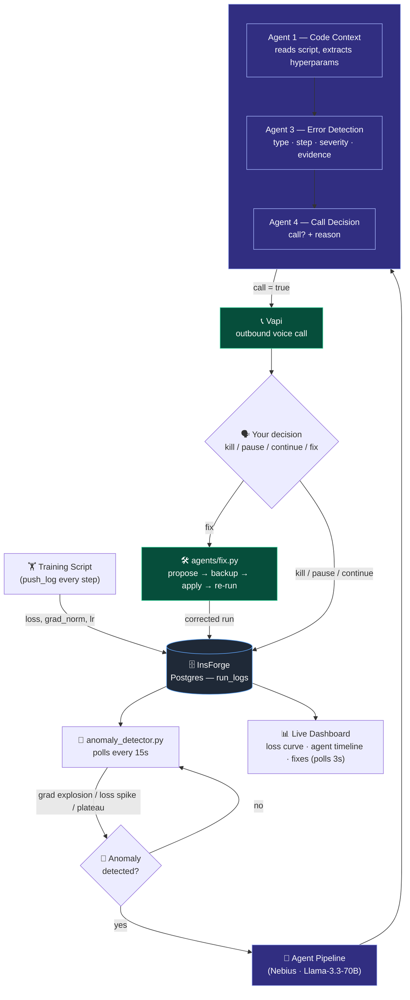
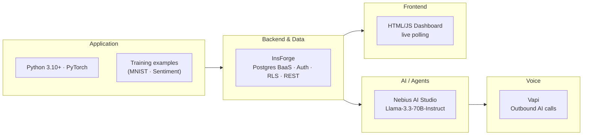

# Code-ICU

> **"I see your run dying. We called."**

Code-ICU is an autonomous ML training monitor that watches your training runs in real time, detects anomalies, phones you with an AI voice call to discuss the failure, and — if you say the word — applies a self-healing code fix and queues a corrected re-run. All without you ever opening a terminal.

---

## What it does

1. Your training script pushes metrics (loss, grad norm, LR) to InsForge every step.
2. A heuristic detector flags gradient explosions, loss spikes, and loss plateaus in the live data.
3. An LLM agent pipeline (powered by Nebius / Llama-3.3-70B) classifies the failure, reasons about the code, and decides whether to call you.
4. If it calls, Vapi dials your phone. The AI assistant explains the anomaly and asks what to do.
5. You say "fix it" — Code-ICU patches the training script, backs up the original, and registers a corrected re-run.
6. The live dashboard shows loss curves, agent reasoning, call outcomes, and applied fixes in real time.

---

## Architecture



### Technologies used



<details>
<summary>Detailed text diagram</summary>

```
Training script
    │  push_log() every step
    ▼
InsForge (Postgres BaaS)
  └─ run_logs table
    │
    ▼
anomaly_detector.py   ← polls every 15s
  ├─ grad explosion (norm > 100)
  ├─ loss spike     (2× median in window)
  └─ loss plateau   (Δ < 0.001 over 20 steps)
    │  ANOMALY DETECTED
    ▼
Agent pipeline (agents/runtime.py → Nebius LLM)
  ┌──────────────────────────────────────────────┐
  │  Agent 1 – Code Context                      │
  │    Reads the training script; extracts        │
  │    architecture, hyperparams, failure points. │
  │    Output cached to code_context.json.        │
  │                                              │
  │  Agent 2 – Monitor (health narration)         │
  │                                              │
  │  Agent 3 – Error Detection                   │
  │    Returns: error_type, step, severity,       │
  │             evidence (JSON)                  │
  │                                              │
  │  Agent 4 – Call Decision                     │
  │    Returns: call (bool), reason              │
  └──────────────────────────────────────────────┘
    │  call=true
    ▼
Vapi – outbound phone call to researcher
  └─ Conversation & Fix agent (Agent 5)
       explains anomaly, asks: kill / pause / continue / fix
    │  decision extracted from transcript
    ▼
  fix → agents/fix.py
    ├─ propose_fix()  – LLM proposes minimal code edits
    ├─ apply_fix()    – backs up file, applies edits, logs to changes.txt
    └─ spawn_rerun()  – registers a new linked run in InsForge

dashboard/index.html
  live-polls InsForge every 3s → loss chart, agent timeline,
  call decisions, applied fixes
```

</details>

### Data model (InsForge / Postgres)

| Table | Purpose |
|---|---|
| `run_logs` | step, loss, grad\_norm, lr per training step |
| `runs` | run registry (name, status, parent\_run\_id) |
| `agents` | LLM agent definitions — key, model, system\_prompt, params |
| `agent_events` | full trace of every agent input/output |
| `call_decisions` | call outcome per anomaly (kill / pause / continue / fix / not\_called) |
| `fix_attempts` | applied code edits, backup path, status |
| `profiles` | user ownership (RLS) |

### Services

| Service | Role |
|---|---|
| **InsForge** | Postgres BaaS — database, auth, RLS, REST API |
| **Nebius AI Studio** | LLM inference (Llama-3.3-70B-Instruct, OpenAI-compatible) |
| **Vapi** | Outbound voice AI calls |

---

## Repo layout

```
Code-ICU/
├── log_pusher.py            # push_log() — one call per training step
├── anomaly_detector.py      # heuristic detection on recent run_logs
├── agents/
│   ├── code_context.py      # Agent 1: analyze the training script
│   ├── monitor.py           # Orchestrator: runs the full pipeline
│   ├── runtime.py           # Registry-driven Nebius agent runner
│   ├── fix.py               # Agent 5: propose → apply → rollback
│   ├── trace.py             # Persist agent events to InsForge
│   ├── nebius_client.py     # OpenAI-compat client + decision extractor
│   └── sync_vapi.py         # Push agent 5 prompt to Vapi assistant
├── dashboard/
│   ├── index.html           # Live monitoring UI (InsForge auth-gated)
│   └── login.html           # OAuth login page
├── demo/
│   └── dummy_training.py    # Simulated run — spikes at step 50
├── examples/
│   ├── mnist_mlp.py         # Real MNIST run (healthy)
│   ├── mnist_mlp_fail.py    # Bug: pixels not normalized → NaN loss
│   ├── text_sentiment.py    # Sentiment classifier (healthy)
│   ├── text_sentiment_fail.py  # Bug: LR=30.0 → loss spikes immediately
│   └── _common.py           # Shared helpers for examples
└── migrations/
    └── 20260619183440_init-schema.sql
```

---

## Quick start

### 1. Prerequisites

- Python 3.10+
- An [InsForge](https://insforge.dev) project with the schema applied (`migrations/`)
- A [Nebius AI Studio](https://studio.nebius.ai) API key
- A [Vapi](https://vapi.ai) account with an assistant and phone number (for the call feature)

### 2. Clone and install

```bash
git clone <repo-url> Code-ICU
cd Code-ICU
python -m venv venv && source venv/bin/activate
pip install httpx python-dotenv openai torch datasets
```

### 3. Configure `.env`

```bash
cp .env.example .env   # or create from scratch
```

```env
INSFORGE_URL=https://<your-project>.us-east.insforge.app
INSFORGE_ANON_KEY=anon_...
INSFORGE_SERVICE_KEY=service_...

NEBIUS_API_KEY=...
NEBIUS_BASE_URL=https://api.studio.nebius.ai/v1
NEBIUS_MODEL=meta-llama/Llama-3.3-70B-Instruct

VAPI_API_KEY=...
VAPI_ASSISTANT_ID=...
VAPI_PHONE_NUMBER_ID=...
MY_PHONE_NUMBER=+1xxxxxxxxxx   # your number, E.164 format
```

### 4. Seed the agent registry

The five agent prompts live in the InsForge `agents` table. Seed them once (SQL or via the dashboard) with keys: `code_context`, `monitor`, `error_detection`, `call_decision`, `conversation_fix`.

Then sync the Conversation & Fix prompt to Vapi:

```bash
python agents/sync_vapi.py
```

### 5. Run a training script

Open two terminals.

**Terminal 1 — start a training run:**

```bash
# Simulated demo (spikes at step 50):
python demo/dummy_training.py

# Or a real PyTorch example with a deliberate bug:
python examples/mnist_mlp_fail.py
# prints: RUN_ID=mnist-mlp-fail-142301
```

**Terminal 2 — start the agent monitor:**

```bash
# Analyze the script first (one-time per script):
python agents/code_context.py demo/dummy_training.py

# Then watch the run:
python agents/monitor.py <RUN_ID>
```

The monitor polls InsForge every 15 seconds. When it detects an anomaly it runs the full agent pipeline, optionally calls your phone, and applies a fix if you ask for one.

### 6. Open the dashboard

Open `dashboard/index.html` in a browser (or serve it with any static server). Sign in with your InsForge account. The dashboard auto-refreshes every 3 seconds showing:

- Live loss curve with anomaly points highlighted in red
- Call decisions table
- Full agent event timeline
- Applied code fixes and rollback status

---

## Using Code-ICU with your own training script

Add two lines to your existing training loop:

```python
from log_pusher import push_log

# inside your training loop:
push_log(run_id, step, loss, grad_norm=grad_norm, lr=current_lr)
```

Then run the monitor against your `run_id`:

```bash
python agents/code_context.py path/to/your_script.py
python agents/monitor.py <your-run-id>
```

---

## Self-healing & rollback

When the researcher says "fix it" on the call, the fix agent:

1. Reads the current training script.
2. Asks the LLM for the smallest edit that addresses the root cause.
3. Backs up the original to `backups/`.
4. Applies the edit in-place.
5. Logs the change to `changes.txt`.
6. Registers a new linked run (`<run-id>-fix-HHMMSS`) in InsForge.

To inspect or reverse any fix:

```bash
python agents/fix.py list
python agents/fix.py rollback [change_id]   # defaults to latest
```

---

## Anomaly detection thresholds

Defined in `anomaly_detector.py` — adjust to your training regime:

| Anomaly | Default threshold |
|---|---|
| Gradient explosion | `grad_norm > 100` (or non-finite) |
| Loss spike | `loss > 2× median` in a 30-step window |
| Loss plateau | `max − min < 0.001` over 20 consecutive steps |

---

## Example bugs Code-ICU catches

| Script | Bug | Symptom | Agent diagnosis |
|---|---|---|---|
| `mnist_mlp_fail.py` | Pixels never divided by 255 | Gradients blow up → NaN loss | `grad_explosion`, severity: critical |
| `text_sentiment_fail.py` | Learning rate set to `30.0` | Loss spikes within the first few steps | `loss_spike`, severity: high |
| `demo/dummy_training.py` | Hardcoded spike at step 50 | Sudden loss jump + large grad norm | `grad_explosion`, severity: high |

---

## Environment variables reference

| Variable | Required | Description |
|---|---|---|
| `INSFORGE_URL` | Yes | InsForge project API base URL |
| `INSFORGE_ANON_KEY` | Yes | Dashboard (client-side, RLS-scoped) |
| `INSFORGE_SERVICE_KEY` | Yes | Backend agents (bypasses RLS) |
| `NEBIUS_API_KEY` | Yes | Nebius AI Studio key |
| `NEBIUS_BASE_URL` | Yes | Nebius API endpoint |
| `NEBIUS_MODEL` | Yes | Model ID (default: Llama-3.3-70B-Instruct) |
| `VAPI_API_KEY` | For calls | Vapi API key |
| `VAPI_ASSISTANT_ID` | For calls | Pre-configured Vapi assistant |
| `VAPI_PHONE_NUMBER_ID` | For calls | Outbound phone number in Vapi |
| `MY_PHONE_NUMBER` | For calls | Your number in E.164 format |
| `CALL_PREFS` | Optional | JSON blob of user preferences passed to Call Decision agent |
